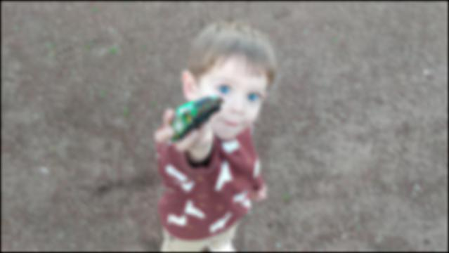

# SRCNN Pytorch Implementation

### Implementation of [https://arxiv.org/abs/1501.00092](https://arxiv.org/abs/1501.00092) - Image Super-Resolution Using Deep Convolutional Networks ([Original Caffe Model](http://mmlab.ie.cuhk.edu.hk/projects/SRCNN.html)) on Holopix50k Stereo Dataset

### Requirements:
* Pytorch > 1.4.0
* tqdm >= 4.42.1 (train progress bar can be found [here](https://github.com/tqdm/tqdm))
* TensorboardX >= 2.0
* PIL.Image(Pillow) >= 7.0.0
* Scikit-image >= 0.16.2
* h5py >= 2.10.0

### Additions to common Pytorch implementation:
* Added SSIM, PSNR, and MSSIM as training and logging metrics.
* Trained on high resolution `(640 X 360) Train, (1280 X 720) Test)` Holopix50k images. 

### Dataset

Instructions to download Holopix50k can be found on [Holopix50k repository](https://github.com/leiainc/holopix50k) ([Paper](https://arxiv.org/abs/2003.11172)). Training on 5000 images of Holopix50k with 120 X 78 patch and stride yields ~500,000 patches of size `(120 X 120)`. Random crop patches can be decreased by altering size in `preprocess.py`. Output dataset is stored at `output/<dataset.h5>`

**Note:**  Our crop sizes are significantly higher than original paper's size. Authors train with a crop size of 33 and stride 14, resulting in ~ 24,000 images from the 91-image dataset which has average resolution of `(180X150)`. Moreover, we apply a gaussian kernel of a higher standard deviation (0.55 in paper vs 0.73 ours) Hence, our input images have a much lower quality compared to the original implementation and make our training more challenging.

### Model
SRCNN 9-5-5 was chosen due to nature of large resolution. 
Chosen Network Settings: .

### Training

Training was performed under paper conditions for 100 epochs using MSE Loss as training loss. Training was stopped when Validation PSNR flattened at ~80.10. 

SSIM was calculated during eval. Similarity score peaked at 0.99, thus suggesting that SSIM is not reliable for SR tasks.

## Saved Weights

* Saved Weights for training using original MSE Loss can be downloaded [here](https://drive.google.com/file/d/1JUfM9vzzaSlyVS3_4xACBEwZv1FFSuhC/view?usp=sharing)
* Saved weights for training using our weighted loss can be downloaded [here](https://drive.google.com/file/d/1Jq-fWU-htYqMfIs6jTl1Rk8oFzUrWgAn/view?usp=sharing)

### Results 

<table>
    <tr>
        <td>
Synthesized Low Res Image
</td>
        <td>
BICUBIC (X3)
</td>
        <td>
SRCNN (X3) , PSNR ~= 87.30
</td>
        <td>
Original
</td>
    </tr>
    <tr>
    	<td>
    		

    	</td>
    	<td>
    		

    	</td>
    	<td>
    		

    	</td>
        <td>
    		

    	</td>
    </tr>
    <tr>
        <td>
Synthesized Low Res Image
</td>
        <td>
BICUBIC (X3)
</td>
        <td>
SRCNN (X3) , PSNR ~= 82.10
</td>
        <td>
Original
</td>
    </tr>
    <tr>
    	<td>
    		

    	</td>
    	<td>
    		

    	</td>
    	<td>
    		

    	</td>
        <td>
    		

    	</td>
    </tr>
    <tr>
        <td>
Synthesized Low Res Image
</td>
        <td>
BICUBIC (X3)
</td>
        <td>
SRCNN (X3) , PSNR ~= 84.21
</td>
        <td>
Original
</td>
    </tr>
    <tr>
    	<td>
    		

    	</td>
    	<td>
    		

    	</td>
    	<td>
    		

    	</td>
        <td>
    		

    	</td>
    </tr>
      <tr>
        <td>
Synthesized Low Res Image
</td>
        <td>
BICUBIC (X3)
</td>
        <td>
SRCNN (X3) , PSNR ~= 85.53
</td>
        <td>
Original
</td>
    </tr>
    <tr>
    	<td>
    		

    	</td>
    	<td>
    		

    	</td>
    	<td>
    		

    	</td>
        <td>
    		

    	</td>
    </tr>
</table>

### Experiments

We have also trained using a weighted loss function from 3 image reconstruction metrics
* Structural Similarity Index (SSIM)
* Peak Signal-to-Noise Ratio (PSNR)
* Mean Square Error (MSE)

We have weighted these according to result priority. Our current weighting is:

We have also trained out model using Peak Signal-to-Noise Ratio (PSNR Score)  as a loss function. Below are our results:

* **Weighted Loss:** We are able to reduce the heavy gaussian blurring with our weighted loss at the cost of loosing slight structural information.
* **PSNR Loss:** Similar results as weighted loss.
	### Training with Weighted Loss

	<table>
    <tr>
        <td>
MSE Trained Result
</td>
        <td>
Weighted Trained Result
</td>
 
    </tr>
    <tr>
    	<td>
    		

    	</td>
    	<td>
    		

    	</td>
 
    </tr>
    <tr>
        <td>
MSE Trained Result
</td>
        <td>
Weighted Trained Result
</td> 
    </tr>
    <tr>
    	<td>
    		

    	</td>
    	<td>
    		

    	</td>  
    </tr>
	</table>
	
	### Training on PSNR Only

	We observed very similar results to our weighted loss after using 1-PSNR as a loss function. Please Zoom in to see slight structural changes. 
	<table>
	<tr>
        <td>
MSE Trained Result
</td>
        <td>
PSNR Trained Result
</td> 
		<td>
Original
</td> 
    </tr>
    <tr>
    	<td>
    		

    	</td>
    	<td>
    		

    	</td>  
		<td>
    		

    	</td> 
    </tr>
	</table>

### Visualized Filters (Optional)

We visualize our trained Conv filters of size `(9X9)` (Trained with MSE Loss). We can identify that some filters are edge vs texture detectors. This is reflective of the original implementation's findings.

### TODO
* ~~Save filters during training~~
* Add accelerated SRCNN model with deconvolutions
* ~~Train with SSIM, MSSIM, PSNR opposed to MSE Loss specified in paper~~
* Pretrain Y channel and CB, Cr channels for better results

